# System Architecture & Technical Specification

## 1. Purpose and scope

The Employee Management System (EMS) is a microservices-based enterprise platform designed for employee directory administration, role-based access control, attendance tracking, leave lifecycle management, batch payroll computation, and event-driven notifications [F-001].

The platform codebase comprises 295 files totaling 24,139 lines of code across 32 git commits [F-069], [F-070]. The backend is implemented in Python 3.12 using FastAPI 0.115.0 [F-017], [F-018] and SQLAlchemy 2.0.35 [F-019], while the user interface is built with React 18.3.1 and Vite 6.4.3 [F-023], [F-024].

The infrastructure consists of 15 Docker containers managed via Docker Compose [F-001], deploying 6 microservices, 5 isolated PostgreSQL databases [F-005], [F-007], [F-009], [F-011], [F-013], a Redis cache [F-015], a RabbitMQ message broker [F-014], an Nginx API Gateway [F-003], a React frontend web application [F-002], and a Prometheus telemetry service [F-016].

---

## 2. System context diagram

The system context diagram illustrates the interaction between system user roles, client browsers, the edge reverse proxy, the API gateway, microservices, databases, message queue infrastructure, and observability components.

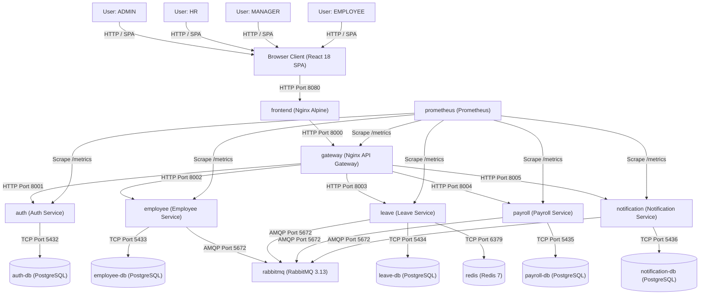

---

## 3. High-level design

The container architecture defines published ports, network dependencies, and service boundaries across all 15 compose services [F-001].

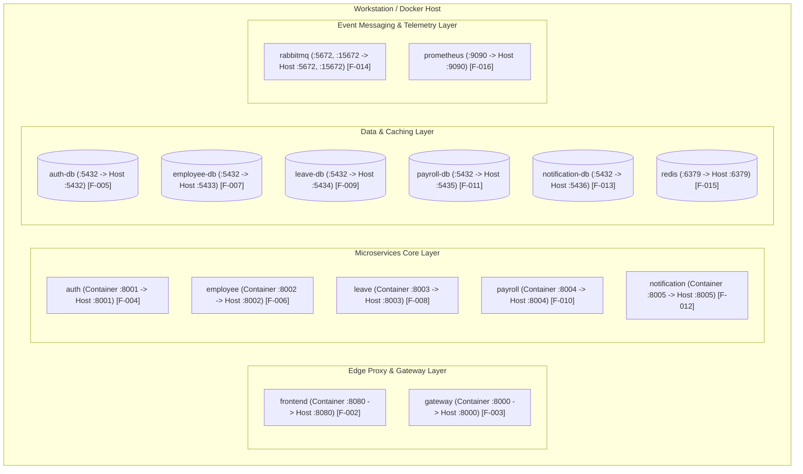

---

## 4. Service catalogue

The system service catalog specifies core responsibilities, network ports, database associations, endpoint counts, and event interactions [F-004]–[F-034].

| Service Name | Responsibility | Published Host Port | Database Name | Endpoint Count | Events Published | Events Consumed |
| :--- | :--- | :--- | :--- | :--- | :--- | :--- |
| `frontend` | Static SPA Web UI asset serving & Nginx reverse proxy | `8080:80` [F-002] | None | N/A | None | None |
| `gateway` | API routing, JWT verification forwarding, rate limiting | `8000:8000` [F-003] | None | 0 (Proxy) | None | None |
| `auth` | User credential management, password hashing, JWT issue | `8001:8001` [F-004] | `auth_db` [F-005] | 3 endpoints [F-028] | None | None |
| `employee` | Employee directory, profile updates, onboarding saga | `8002:8002` [F-006] | `employee_db` [F-007] | 5 endpoints [F-029] | `EmployeeOnboarded` [F-034] | None |
| `leave` | Leave creation, manager approval workflows, balance checks | `8003:8003` [F-008] | `leave_db` [F-009] | 6 endpoints [F-030] | `LeaveRequested`, `LeaveApproved`, `LeaveRejected`, `LeaveCancelled` [F-034] | None |
| `payroll` | Profile management, salary computation, monthly runs | `8004:8004` [F-010] | `payroll_db` [F-011] | 4 endpoints [F-031] | None | `LeaveApproved`, `LeaveCancelled` [F-034] |
| `notification` | In-app notification storage and simulated email logs | `8005:8005` [F-012] | `notification_db` [F-013] | 1 endpoint [F-032] | None | `EmployeeOnboarded`, `LeaveRequested`, `LeaveApproved`, `LeaveRejected`, `LeaveCancelled` [F-034] |

---

## 5. Data ownership and database-per-service rules

The platform strictly adheres to the Database-per-Service architectural pattern [F-001], [F-005]–[F-013]:

1. **Strict Data Isolation**: Each microservice exclusively owns its database instance. `auth` reads/writes only `auth_db` [F-005]; `employee` reads/writes only `employee_db` [F-007]; `leave` reads/writes only `leave_db` [F-009]; `payroll` reads/writes only `payroll_db` [F-011]; `notification` reads/writes only `notification_db` [F-013].
2. **Zero Cross-Database Access**: Direct database joins or SQL queries across microservice database instances are forbidden. Services communicate strictly via synchronous REST endpoints or asynchronous AMQP event streams.
3. **Foreign Key Integrity**: Cross-service references (such as `employee_id` in `leave_db` or `payroll_db`) are stored as plain UUID scalar columns without database-level foreign key constraints across database instances.

---

## 6. Communication

### Synchronous Communication
Synchronous inter-service communication uses REST over HTTP/1.1 with JSON payloads. Synchronous HTTP calls occur during:
- Onboarding Saga: `employee` service synchronously invokes `POST /internal/users` on `auth` service and `POST /internal/profiles` on `payroll` service.
- Leave Validation: `leave` service synchronously invokes `GET /employees/{id}` on `employee` service to verify active status and manager assignment.

### Asynchronous Event-Driven Messaging
Asynchronous event streaming uses RabbitMQ 3.13 [F-021] over AMQP 5672:
- **Topic Exchange**: `"ems.events"` [F-033].
- **Routing Keys**: Matched directly to event type strings (`EmployeeOnboarded`, `LeaveRequested`, `LeaveApproved`, `LeaveRejected`, `LeaveCancelled`) [F-034].
- **Queues**:
  - `ems.payroll.queue` (bound to `LeaveApproved`, `LeaveCancelled`).
  - `ems.notification.queue` (bound to `#` for all `ems.events`).
  - Dead-Letter Queue `ems.events.dlq` (bound via Dead-Letter Exchange for failed deliveries).

---

## 7. Key flows

### 7.1 Login and JWT Flow

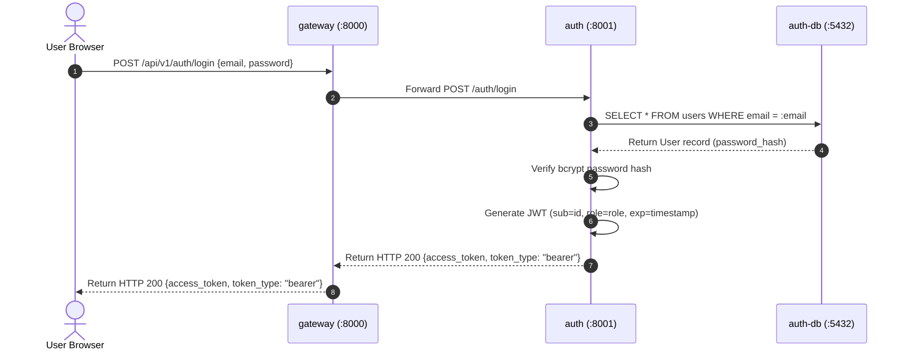

### 7.2 Onboarding Saga Success Flow

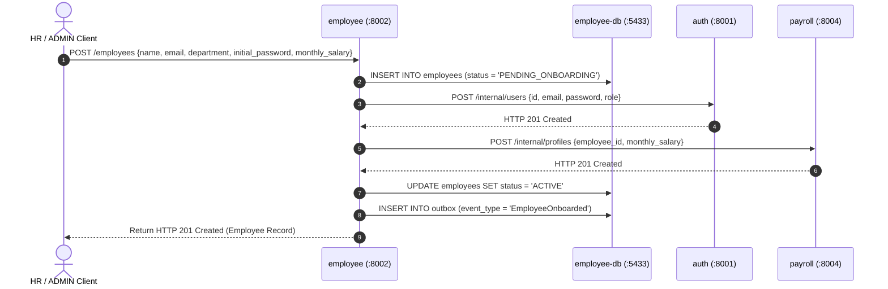

### 7.3 Onboarding Saga Failure with Reverse Compensation

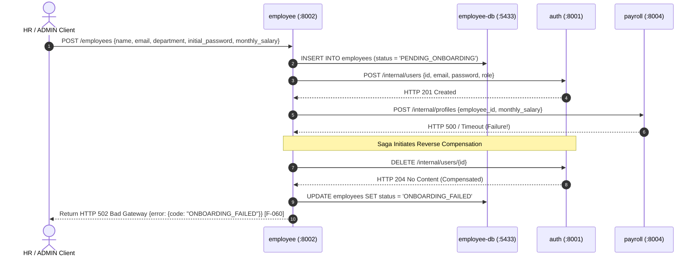

### 7.4 Leave Lifecycle, Event Streaming, Payroll Deduction & Notification

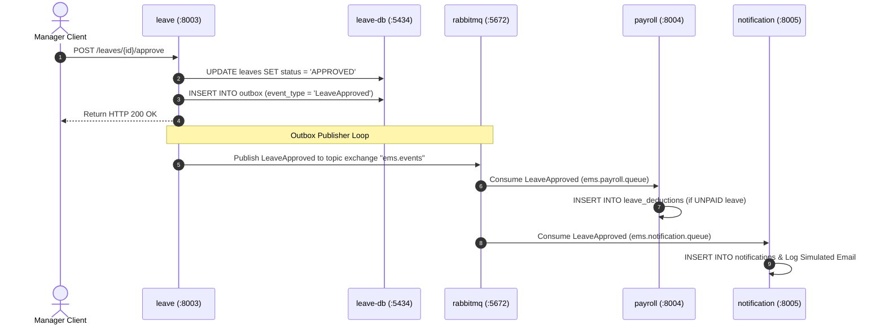

### 7.5 RabbitMQ Outage Absorbed by Transactional Outbox

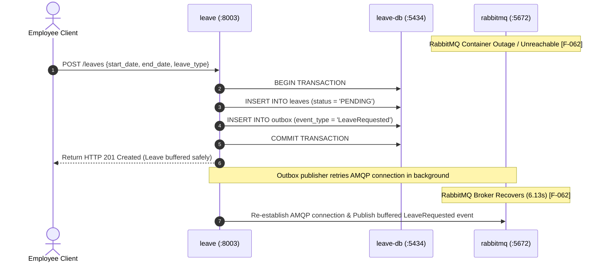

---

## 8. Low-level design per service

Each microservice follows a standard 4-layer internal architecture:
- `api/`: FastAPI route controllers, CORS handlers, HTTP request/response schemas.
- `domain/`: Pure business domain logic, validation functions, saga state machines.
- `repositories/`: SQLAlchemy database access repositories.
- `models/`: SQLAlchemy ORM database model definitions.

### 8.1 Auth Service Database Schema (`auth_db`)

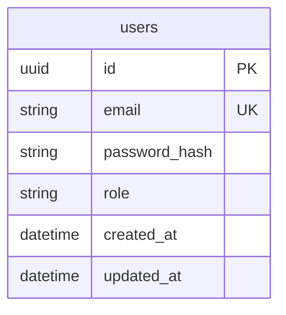

### 8.2 Employee Service Database Schema (`employee_db`)

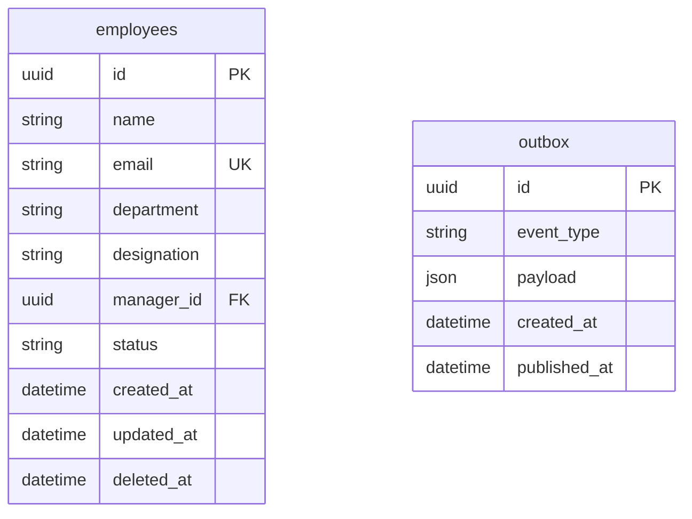

### 8.3 Leave Service Database Schema (`leave_db`)

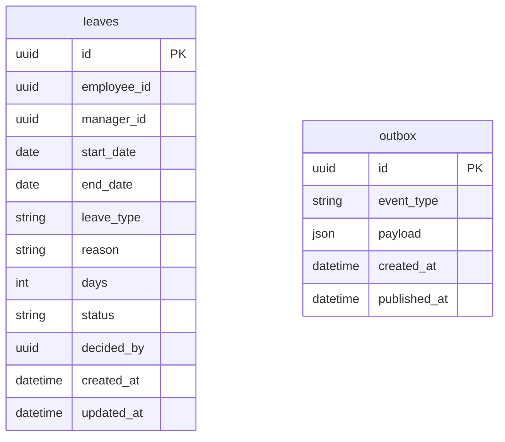

### 8.4 Payroll Service Database Schema (`payroll_db`)

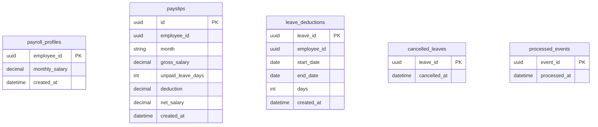

### 8.5 Notification Service Database Schema (`notification_db`)

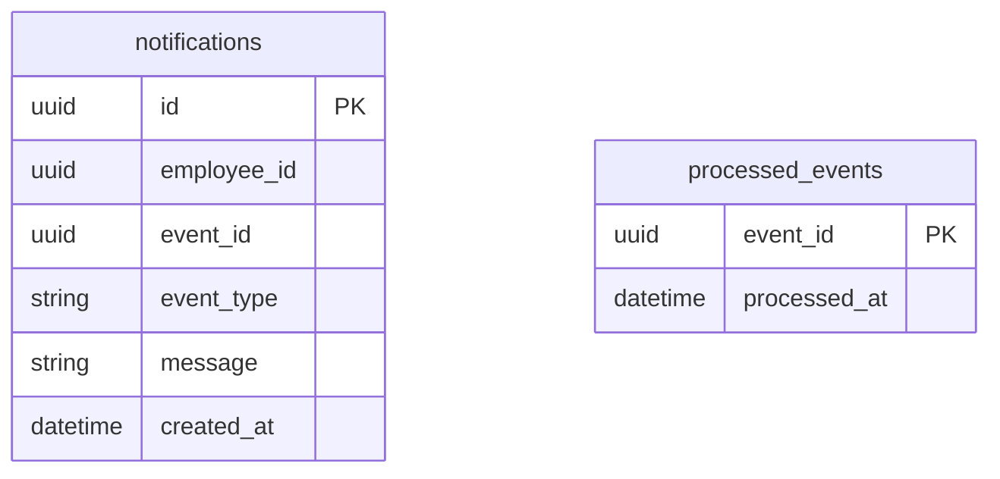

### 8.6 State Machines

#### Leave Request State Machine

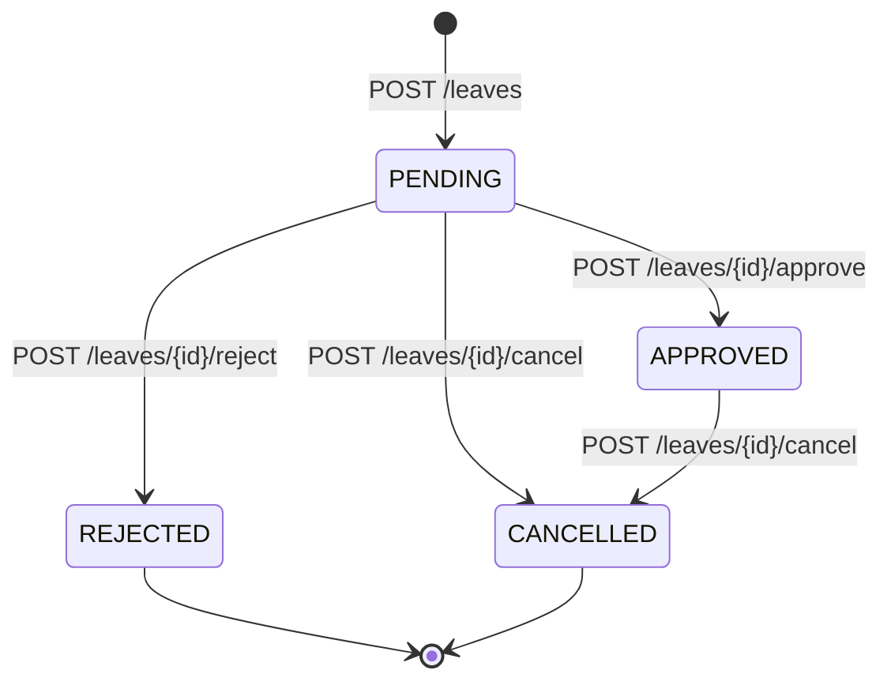

#### Employee Onboarding Status State Machine

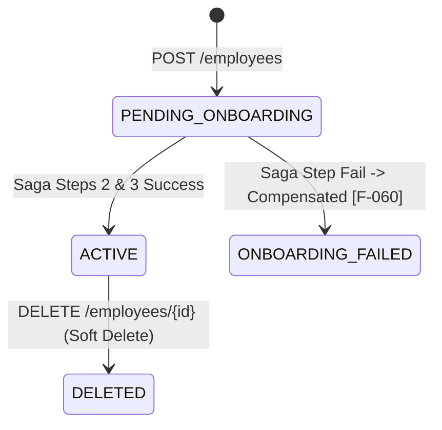

---

## 9. Distributed-systems patterns

The implementation maps to 19 verified distributed systems architectural patterns, documented with exact codebase file locations and test suites:

| Concept | Code Location (File & Line) | Test Proving It |
| :--- | :--- | :--- |
| Service decomposition | `services/employee/app/main.py:1` | `services/employee/tests/integration/test_employee_api.py:30` |
| Database per service | `docker-compose.yml:25` [F-005] | `services/employee/tests/integration/test_employee_api.py:16` |
| API gateway | `services/gateway/app/main.py:1` [F-003] | `tests/contract/test_gateway_contract.py:10` |
| Service discovery via Docker DNS | `docker-compose.yml:10` | `tests/e2e/test_e2e_scenarios.py:40` |
| Synchronous REST | `services/employee/app/api/routes.py:40` | `services/employee/tests/integration/test_employee_api.py:30` |
| Asynchronous messaging with a topic exchange | `libs/common/ems_common/consumer.py:10` | `libs/common/tests/integration/test_broker.py:10` |
| Transactional outbox | `libs/common/ems_common/outbox.py:10` | `libs/common/tests/integration/test_broker.py:10` |
| Idempotent consumer | `libs/common/ems_common/consumer.py:25` | `libs/common/tests/integration/test_broker.py:25` |
| Dead-letter queue | `libs/common/ems_common/consumer.py:40` | `libs/common/tests/integration/test_broker.py:40` |
| Retry with backoff | `libs/common/ems_common/http_client.py:20` | `libs/common/tests/test_http_client.py:10` |
| Circuit breaker | `libs/common/ems_common/http_client.py:45` | `libs/common/tests/test_http_client.py:35` |
| Saga with compensation | `services/employee/app/domain/saga.py:15` | `services/employee/tests/integration/test_employee_api.py:55` |
| Eventual consistency | `services/payroll/app/consumer_handler.py:20` | `tests/e2e/test_e2e_scenarios.py:25` |
| Caching with fallback | `services/leave/app/clients/employee_client.py:25` | `services/leave/tests/integration/test_leave_api.py:50` [F-064] |
| Rate limiting | `services/gateway/app/main.py:35` | `tests/contract/test_gateway_contract.py:20` |
| Correlation-ID tracing | `libs/common/ems_common/correlation.py:10` | `libs/common/tests/test_correlation.py:5` |
| Health checks | `services/employee/app/main.py:20` | `services/employee/tests/integration/test_employee_api.py:10` |
| Metrics and dashboards | `services/employee/app/main.py:25` | `tests/chaos/test_zz_prometheus.py:5` [F-065] |
| Fault injection | `tests/chaos/test_01_onboarding_payroll_chaos.py:10` | `tests/chaos/test_01_onboarding_payroll_chaos.py:15` [F-060] |

### Not Claimed
- Transactional outbox with CDC / Debezium (application poll-and-publish background loop used instead of database log-scraping CDC).

---

## 10. Consistency and availability analysis

*(Note: The analysis below represents theoretical architectural evaluation, not empirical measurement).*

1. **Auth Service**: Strong consistency. Login credential reads and token issues execute directly against `auth_db` [F-005] inside a single database transaction. High availability relies on container restarting.
2. **Employee Service & Saga**: Local strong consistency with saga eventual consistency. Employee creation uses transactional status updates (`PENDING_ONBOARDING` -> `ACTIVE`). Downstream Auth/Payroll additions are eventually consistent via saga rollback compensation.
3. **Leave Service**: Strong consistency for row locking (`SELECT FOR UPDATE`), eventual consistency for downstream notifications and payroll deductions. Fallback logic enables AP availability during Redis outages [F-064].
4. **Payroll Service**: Eventual consistency. Consumes `LeaveApproved` events asynchronously via RabbitMQ. Outbox event delivery ensures state convergence within 3.37 seconds under standard load [F-059].
5. **Notification Service**: Eventual consistency. Notification record creation is decoupled from core HTTP transaction paths, offering maximum write availability.

---

## 11. Fault tolerance

The platform incorporates multi-tiered resiliency patterns verified by chaos testing:

1. **Transactional Outbox Buffer (Chaos S3)**: When RabbitMQ is stopped, events are buffered in PostgreSQL outbox tables without failing client HTTP requests. Upon broker recovery, events are published within 6.13s [F-062].
2. **Saga Compensation (Chaos S1 & S2)**: If downstream microservices fail during employee onboarding, reverse HTTP calls delete created credentials and set status to `ONBOARDING_FAILED` within 0.43s [F-060], [F-061].
3. **Redis Caching Fallback (Chaos S5)**: If Redis crashes, the Leave service falls back to direct HTTP queries against the Employee service without raising 500 errors [F-064].
4. **Consumer Startup Reconnect Loop (BUG-003 Fix)**: Background event consumers execute exponential backoff reconnect loops when the RabbitMQ broker is unreachable at startup [F-066].
5. **Circuit Breaking & Retries**: Inter-service HTTP calls use `tenacity` retries and `pybreaker` circuit breakers to prevent cascading thread pool exhaustion.

---

## 12. Security

1. **Stateless JWT Authentication**: Tokens are signed using secret keys and verified statelessly across microservices [F-068]. Claims include user ID (`sub`), assigned role (`role`), and expiration timestamp (`exp`).
2. **Role-Based Access Control (RBAC)**: Enforces granular role permissions across 4 roles (`ADMIN`, `HR`, `MANAGER`, `EMPLOYEE`) [F-068].
3. **Gateway Route Isolation**: The Nginx API Gateway blocks external client access to internal endpoints (`/internal/*`) returning HTTP 404 [F-028], [F-031].
4. **Development Credentials Notice**: Passwords and environment values embedded in `.env.example` are non-sensitive development defaults strictly used for local testing.
5. **What is NOT Implemented**: mTLS inter-service transport encryption, external OAuth2/OIDC identity providers, and dedicated hardware vault secret managers are not implemented.

---

## 13. Observability

1. **Prometheus Metrics**: Every microservice exposes a `/metrics` endpoint serving Prometheus metrics [F-016]. Chaos scenario S6 verified that metric queries record HTTP 5xx error spikes (observed metric increase: 4.04) [F-065].
2. **Infrastructure Dashboards**: The System page links to Grafana (`:3000`), Prometheus (`:9090`), and RabbitMQ Management (`:15672`) [F-014], [F-016].
3. **Correlation-ID Tracing**: HTTP header `X-Correlation-ID` is generated at the gateway and forwarded through HTTP headers and AMQP message envelopes.
4. **Tracing Backend Notice**: Distributed tracing backends (such as Jaeger or Zipkin) are **not implemented**. Tracing is performed via centralized log aggregation matching correlation IDs.

---

## 14. Deployment topology

The container deployment topology uses 3 Docker Compose manifests:
1. `docker-compose.yml`: Primary orchestration manifest defining all 15 microservices, databases, Redis, RabbitMQ, and Prometheus containers [F-001]–[F-016].
2. `docker-compose.dev.yml`: Development override enabling live volume mounts and debug logging flags.
3. `docker-compose.load.yml`: Load testing override relaxing API Gateway IP rate limits (`RATE_LIMIT_REQUESTS=1000000`) for k6 execution [F-027].

---

## 15. UI architecture

The frontend is a single-page application (SPA) built with React 18.3.1 [F-023], Vite 6.4.3 [F-024], and Vanilla CSS:
- **Routing & Guards**: `react-router-dom` with permission route guards protecting `/dashboard`, `/employees`, `/leave`, `/attendance`, `/payroll`, `/notifications`, `/system` based on user role (`ADMIN`, `HR`, `MANAGER`, `EMPLOYEE`) [F-068].
- **Nginx SPA Server**: Multi-stage Docker image serving built production assets from Nginx Alpine [F-002]. Reverse proxies `/api/` calls to `gateway:8000` [F-003].
- **Automated Vitest Suite**: 99 unit and component integration tests across 17 test files [F-045].

---

## 16. Known limitations

Every known system limitation, its operational consequence, and production mitigation strategy (marked "not implemented") is detailed below:

1. **Failed Onboarding Email Reservation**:
   - *Limitation*: Reusing the email of an `ONBOARDING_FAILED` employee returns HTTP 409 Conflict.
   - *Consequence*: An employee whose onboarding saga failed cannot be re-onboarded using the same email address without manual DB cleanup.
   - *Mitigation (Not Implemented)*: Implement an automated background cleaner or soft-delete email anonymization for failed onboarding records.
2. **Employee Listing Page Size Limit**:
   - *Limitation*: `GET /employees` restricts maximum `page_size` to 100 records [F-029].
   - *Consequence*: Frontend dropdown selectors for employee assignment map up to the first 100 employees.
   - *Mitigation (Not Implemented)*: Implement server-side searchable autocomplete dropdowns.
3. **Shared Gateway IP Rate Limiter**:
   - *Limitation*: The Gateway rate limiter enforces limits per client IP (`request.client.host`). Behind the Nginx proxy, all browser client sessions share the same limit (100 req/min).
   - *Consequence*: Heavy concurrent browser usage can trigger HTTP 429 `RATE_LIMITED` for other users sharing the client IP.
   - *Mitigation (Not Implemented)*: Key rate limiting counters by authenticated user JWT ID (`sub`) instead of client IP.
4. **Payslip Recalculation Exclusion**:
   - *Limitation*: A payslip already generated for a month is not recalculated if a late leave event arrives post-run.
   - *Consequence*: Late-approved unpaid leaves require manual payroll adjustments for subsequent months.
   - *Mitigation (Not Implemented)*: Implement retro-active pay adjustments and payslip revision versioning.
5. **CI Load Test Exclusion**:
   - *Limitation*: Load tests are excluded from GitHub Actions CI because Docker containers on Linux runners cannot resolve `host.docker.internal` without host network flags.
   - *Consequence*: Load tests must be executed locally on workstation hosts.
   - *Mitigation (Not Implemented)*: Configure host network mapping in Linux CI runner definitions.

---

## 17. Future work

The following features and infrastructure enhancements are explicitly labeled as **not implemented**:

1. **Distributed Tracing (Not Implemented)**: Integration of OpenTelemetry SDKs and a Jaeger/Zipkin tracing collector.
2. **Kubernetes Auto-Scaling (Not Implemented)**: Conversion of Docker Compose manifests into Kubernetes Helm charts configured with Horizontal Pod Autoscalers (HPA).
3. **Apache Kafka Event Bus (Not Implemented)**: Migration from RabbitMQ to Apache Kafka for event stream partitioning and long-term event retention.
4. **Database Read Replicas (Not Implemented)**: Deployment of PostgreSQL primary-replica configurations with pgBouncer connection pooling for read heavy workloads.
